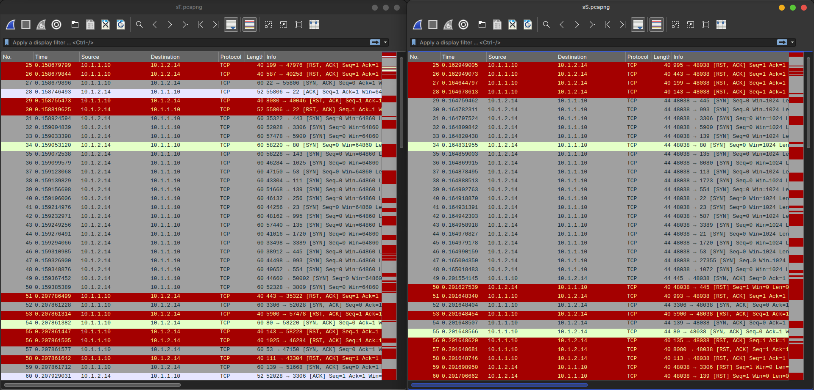

[](https://classroom.github.com/online_ide?assignment_repo_id=10207281&assignment_repo_type=AssignmentRepo)
# HEIGVD - Sécurité des Réseaux - 2023
# Laboratoire n°1 - Port Scanning et initiation à Nmap

[Introduction](#introduction)
[Auteurs](#auteurs)
[Fichiers nécessaires](#fichiers-nécessaires)
[Rendu](#rendu)
[Le réseau de test](#le-réseau-de-test)
[Infrastructure virtuelle](#infrastructure-virtuelle)
[Connexion à l’infrastructure par OpenVPN](#connexion-à-linfrastructure-par-wireguard)
[Réseau d’évaluation](#réseau-dévaluation)
[Scanning avec Nmap](#scanning-avec-nmap)
[Scanning du réseau (découverte de hôtes)](#scanning-du-réseau-découverte-de-hôtes)
[Scanning de ports](#scanning-de-ports)
[Identification de services et ses versions](#identification-de-services-et-ses-versions)
[Détection du système d’exploitation](#détection-du-système-dexploitation)
[Vulnérabilités](#vulnérabilités)

# Introduction

Toutes les machines connectées à un LAN (ou WAN, VLAN, VPN, etc…) exécutent des services qui « écoutent » sur certains ports. Ces services sont des logiciels qui tournent dans une boucle infinie en attendant un message particulier d’un client (requête). Le logiciel agit sur la requête ; on dit donc qu’il « sert ».

Le scanning de ports est l’une des techniques les plus utilisées par les attaquants. Ça permet de découvrir les services qui tournent en attendant les clients. L’attaquant peut souvent découvrir aussi la version du logiciel associé à ce service, ce qui permet d’identifier des éventuelles vulnérabilités.

Dans la pratique, un port scan n’est plus que le fait d’envoyer un message à chaque port et d’en examiner la réponse. Plusieurs types de messages sont possibles et/ou nécessaires. Si le port est ouvert (un service tourne derrière en attendant des messages), il peut être analysé pour essayer de découvrir les vulnérabilités associées au service correspondant.

## Auteurs

Ce texte est basé sur le fichier préparé par Abraham Ruginstein Scharf dans le cadre du
cours Sécurité des Réseaux (SRX) à l'école HEIG/VD, Suisse.
Il a été travaillé et remis en forme pour passer dans un github classroom par
Linus Gasser (@ineiti) du C4DT/EPFL.
L'assistant pour le cours SRX de l'année 2023 est Axel Vallon (@AxelVallon).

## Fichiers nécessaires
Vous recevrez par email tous les fichiers nécessaires pour se connecter à l'infrastructure de ce laboratoire.

## Rendu
Ce laboratoire ne sera ni corrigé ni évalué.
Mais je vous conseille quand même de faire une mise à jour de votre répo avec les réponses.
C'est un bon exercice pour le labo-02 qui sera corrigé et noté.

# Le réseau de test

## Infrastructure virtuelle 
Durant ce laboratoire, nous allons utiliser une infrastructure virtualisée. Elle comprend un certain nombre de machines connectées en réseau avec un nombre différent de services.

Puisque le but de ce travail pratique c’est de découvrir dans la mesure du possible ce réseau, nous ne pouvons pas vous en donner plus de détails ! 

Juste un mot de précaution: vous allez aussi voir tous les autres ordinateurs des étudiants qui se connectent au réseau.
C'est voulu, afin que vous puissiez aussi faire des scans sur ceux-ci.
Par contre, il est formellement interdit de lancer quelconque attaque sur un ordinateur d'un des élèves!
Si on vous demande de s'attaquer aux machines présents dans l'infrastructure de teste, si vous arrivez à en sortir,
contactez immédiatement le prof ou l'assistant pour récolter des points bonus.
Ce n'est pas prévu - mais ça peut arriver :)

## Connexion à l’infrastructure par WireGuard

Notre infrastructure de test se trouve isolée du réseau de l’école. L’accès est fourni à travers une connexion WireGuard.

La configuration de WireGuard varie de système en système. Cependant, dans tous les cas, l’accès peut être géré par un fichier de configuration qui contient votre clé privée ainsi que la clé publique du serveur.

Il est vivement conseillé d’utiliser Kali Linux pour ce laboratoire. WireGuard est déjà préinstallé sur Kali.
Mais ça marche aussi très bien directement depuis un ordinateur hôte - en tout cas j'ai testé Windows et Mac OSX.
Vous trouvez les clients WireGuard ici: https://www.wireguard.com/install/

Vous trouverez dans l’email reçu un fichier de configuration WireGuard personnalisé pour vous (chaque fichier est unique) ainsi que queleques informations relatives à son utilisation. Le fichier contient un certificat et les réglages correctes pour vous donner accès à l’infra.

Une fois connecté à l’infrastructure, vous recevrez une adresse IP correspondante au réseau de test.

Pour vous assurer que vous êtes connecté correctement au VPN, vous devriez pouvoir pinger l’adresse 10.1.2.2.

### Configuration Kali Linux

Pour l'installation dans Kali-Linux, il faut faire la chose suivante:

```bash
sudo -i
apt update
apt install -y wireguard resolvconf
vi /etc/wireguard/wg0.conf # copier le contenu de peerxx.conf
wg-quick up wg0
```

### Réseau d’évaluation

Le réseau que vous allez scanner est le 10.1.1.0/24 - le réseaux 10.1.2.0/24 est le réseaux WireGuard avec tous les
ordinateurs des élèves. On va essayer de le scanner vite fait, mais **INTERDICTION DE FAIRE DU PENTEST SUR CES MACHINES**!

### Distribution des fichiers de configuration

Pour simplifier ce labo, je vous ai directement envoyer les fichiers de configuration.
Mais dans un environnement où on ne fait pas forcément confiance au serveur, ni à la personne qui distribue les
fichiers, ceci n'est pas une bonne pratique.

Quels sont les vectuers d'attaque pour cette distribution?
Qui est une menace?

**Réponse :** Toutes les ressources dans lesquelles on n'a pas confiance. De plus, on pourrait rajouter des intervenants externes comme un cas de MITM (Man In The Middle). Le phishing est un des vecteus d'attaque, on ne peut pas être sûr de l'expéditeur.

Comment est-ce qu'il faudrait procéder pour palier à ces attaques?
Qui devrait envoyer quelle information à qui? Et dans quel ordre?

**Réponse :** Il existe des manières d'authentifier les expéditeurs via des mails. Ainsi, on peut s'assurer que la personne enoyant le message est bien celle que l'on pense. La manière moins possible, mais la plus sécurisée serait l'échange de l'information directemenet en main propre via une clé USB.

On peut aussi utiliser des primitives de cryptographie à clé publique. Ainsi, on peut signer le message et l'envoyer en le chiffrant. Ainsi, le message respecte la confidentialité (grâce au chiffrement) et son intégrité et authenticité (grâce à la signature). 

# Scanning avec Nmap

Nmap est considéré l’un des outils de scanning de ports les plus sophistiqués et évolués. Il est développé et maintenu activement et sa documentation est riche et claire. Des centaines de sites web contiennent des explications, vidéos, exercices et tutoriels utilisant Nmap.

## Scanning du réseau (découverte de hôtes)

Le nom « Nmap » implique que le logiciel fut développé comme un outil pour cartographier des réseaux (Network map). Comme vous pouvez l’imaginer, cette fonctionnalité est aussi attirante pour les professionnels qui sécurisent les réseaux que pour ceux qui les attaquent.

Avant de pouvoir se concentrer sur les services disponibles sur un serveur en particulier et ses vulnérabilités, il est utile/nécessaire de dresser une liste d’adresses IP des machines présentes dans le réseau. Ceci est particulièrement important, si le réseau risque d’avoir des centaines (voir des milliers) de machines connectées. En effet, le scan de ports peut prendre long temps tandis que la découverte de machines « vivantes », est un processus plus rapide et simple. Il faut quand-même prendre en considération le fait que la recherche simple de hôtes ne retourne pas toujours la liste complète de machines connectées.

Nmap propose une quantité impressionnante de méthodes de découverte de hôtes. L’utilisation d’une ou autre méthode dépendra de qui fait le scanning (admin réseau, auditeur de sécurité, pirate informatique, amateur, etc.), pour quelle raison le scanning est fait et quelle infrastructure est présente entre le scanner et les cibles.

Questions

a.	Quelles options sont proposées par Nmap pour la découverte de hôtes ? Servez-vous du menu « help » de Nmap (nmap -h), du manuel complet (man nmap) et/ou de la documentation en ligne.   

**Réponse :** C'est le premier qui n'est pas détecté avec `-sn`, il est détecté par scan de port.
  
```
HOST DISCOVERY:
  -sL: List Scan - simply list targets to scan
  -sn: Ping Scan - disable port scan
  -Pn: Treat all hosts as online -- skip host discovery
  -PS/PA/PU/PY[portlist]: TCP SYN/ACK, UDP or SCTP discovery to given ports
  -PE/PP/PM: ICMP echo, timestamp, and netmask request discovery probes
  -PO[protocol list]: IP Protocol Ping
  -n/-R: Never do DNS resolution/Always resolve [default: sometimes]
  --dns-servers <serv1[,serv2],...>: Specify custom DNS servers
  --system-dns: Use OS's DNS resolver
  --traceroute: Trace hop path to each host
```

b.	Essayer de dresser une liste des hôtes disponibles dans le réseau en utilisant d’abord un « ping scan » (No port scan) et ensuite quelques autres des méthodes de scanning (dans certains cas, un seul type de scan pourrait rater des hôtes).

Adresses IP trouvées :

**Réponse :** 

```
Host is up (0.039s latency).
Nmap scan report for labo-1-nmap-infra_netcat_1.labo-1-nmap-infra_customnetwork (10.1.1.3)
Host is up (0.039s latency).
Nmap scan report for labo-1-nmap-infra_web_1.labo-1-nmap-infra_customnetwork (10.1.1.4)
Host is up (0.039s latency).
Nmap scan report for labo-1-nmap-infra_couchdb_1.labo-1-nmap-infra_customnetwork (10.1.1.5)
Host is up (0.039s latency).
Nmap scan report for labo-1-nmap-infra_huge_1.labo-1-nmap-infra_customnetwork (10.1.1.10)
Host is up (0.039s latency).
Nmap scan report for labo-1-nmap-infra_dns_1.labo-1-nmap-infra_customnetwork (10.1.1.11)
Host is up (0.034s latency).
Nmap scan report for labo-1-nmap-infra_grafana_1.labo-1-nmap-infra_customnetwork (10.1.1.12)
Host is up (0.034s latency).
Nmap scan report for labo-1-nmap-infra_jenkins_1.labo-1-nmap-infra_customnetwork (10.1.1.14)
Host is up (0.020s latency).
Nmap scan report for labo-1-nmap-infra_jupyter_1.labo-1-nmap-infra_customnetwork (10.1.1.20)
Host is up (0.022s latency).
Nmap scan report for labo-1-nmap-infra_sshd_1.labo-1-nmap-infra_customnetwork (10.1.1.21)
Host is up (0.022s latency).
Nmap scan report for labo-1-nmap-infra_solr_1.labo-1-nmap-infra_customnetwork (10.1.1.22)
Host is up (0.023s latency).
Nmap scan report for labo-1-nmap-infra_mysql_1.labo-1-nmap-infra_customnetwork (10.1.1.23)
Host is up (0.034s latency).
Nmap done: 256 IP addresses (12 hosts up) scanned in 3.35 seconds
```

Avez-vous constaté des résultats différents en utilisant les différentes méthodes ? Pourquoi pensez-vous que ça pourrait être le cas ?

**Réponse :** -sL 

```
C:\home\alexis\Desktop> nmap -sL 10.1.1.0/24
Starting Nmap 7.80 ( https://nmap.org ) at 2023-02-20 15:41 CET
Nmap scan report for 10.1.1.0
Nmap scan report for dedi.gasser.blue (10.1.1.1)
Nmap scan report for wireguard.labo-1-nmap-infra_customnetwork (10.1.1.2)
Nmap scan report for labo-1-nmap-infra_netcat_1.labo-1-nmap-infra_customnetwork (10.1.1.3)
Nmap scan report for labo-1-nmap-infra_web_1.labo-1-nmap-infra_customnetwork (10.1.1.4)
Nmap scan report for labo-1-nmap-infra_couchdb_1.labo-1-nmap-infra_customnetwork (10.1.1.5)
Nmap scan report for 10.1.1.6
Nmap scan report for 10.1.1.7
Nmap scan report for 10.1.1.8
Nmap scan report for 10.1.1.9
Nmap scan report for labo-1-nmap-infra_huge_1.labo-1-nmap-infra_customnetwork (10.1.1.10)
Nmap scan report for labo-1-nmap-infra_dns_1.labo-1-nmap-infra_customnetwork (10.1.1.11)
Nmap scan report for labo-1-nmap-infra_grafana_1.labo-1-nmap-infra_customnetwork (10.1.1.12)
Nmap scan report for 10.1.1.13
Nmap scan report for labo-1-nmap-infra_jenkins_1.labo-1-nmap-infra_customnetwork (10.1.1.14)
Nmap scan report for 10.1.1.15
Nmap scan report for 10.1.1.16
Nmap scan report for 10.1.1.17
Nmap scan report for 10.1.1.18
Nmap scan report for 10.1.1.19
Nmap scan report for labo-1-nmap-infra_jupyter_1.labo-1-nmap-infra_customnetwork (10.1.1.20)
Nmap scan report for labo-1-nmap-infra_sshd_1.labo-1-nmap-infra_customnetwork (10.1.1.21)
Nmap scan report for labo-1-nmap-infra_solr_1.labo-1-nmap-infra_customnetwork (10.1.1.22)
Nmap scan report for labo-1-nmap-infra_mysql_1.labo-1-nmap-infra_customnetwork (10.1.1.23)
```

Quelles options de scanning sont disponibles si vous voulez être le plus discret possible ?

**Réponse :**  Il faut utiliser `-sS` qui utilise des paquets TCP SYN et qui ne ferme pas la connexion TCP.

## Scanning de ports

Il y a un total de 65'535 ports TCP et le même nombre de ports UDP, ce qui rend peu pratique une analyse de tous les ports, surtout sur un nombre important de machines. 

N’oublions pas que le but du scanning de ports est la découverte de services qui tournent sur le système scanné. Les numéros de port étant typiquement associés à certains services connus, une analyse peut se porter sur les ports les plus « populaires ».

Les numéros des ports sont divisés en trois types :

-	Les ports connus : du 0 au 1023
-	Les ports enregistrés : du 1024 au 49151
-	Les ports dynamiques ou privés : du 49152 au 65535

Questions
c.	Complétez le tableau suivant :

**Réponse :**

| Port  | Service             | Protocole (TCP/UDP) |
| :---: | :---:               | :---:               |
| 20/21 | FTP (File Transfer) | TCP                 |
| 22    | SSH (Secure Shell)  | TCP                 |
| 23    | Telnet              | TCP                 |
| 25    | SMTP (Simple Mail Transfer) | TCP          |
| 53    | DNS (Domain Name System) | TCP/UDP         |
| 67/68 | DHCP (Dynamic Host Configuration Protocol) | UDP |
| 69    | TFTP (Trivial File Transfer Protocol) | UDP |
| 80    | HTTP (Hypertext Transfer Protocol) | TCP     |
| 110   | POP3 (Post Office Protocol version 3) | TCP   |
| 443   | HTTPS (HTTP Secure) | TCP                 |
| 3306  | MySQL Database | TCP                      |

d.	Par défaut, si vous ne donnéz pas d’option à Nmap concernant les port, quelle est la politique appliquée par Nmap pour le scan ? Quels sont les ports qui seront donc examinés par défaut ? Servez-vous de la documentation en ligne pour trouver votre réponse.

**Réponse :** Par défaut c'est le scan SYN qui est utilisé par NMAP. Les ports scannés sont les 1000 premiers ports les plus utilisés pour chaque protocole.


e.	Selon la documentation en ligne de Nmap, quels sont les ports TCP et UDP le plus souvent ouverts ? Quels sont les services associés à ces ports ?   

**Réponse :** Ils disent que ce sont les ports des services les plus utilisés tels que les services mail (POP, IMAP, SMTP), les services web (HTTP, HTTPS) et les services réseau (DNS, DHCP, etc...).


f.	Dans les commandes Nmap, de quelle manière peut-on cibler un numéro de port spécifique ou un intervalle de ports ? Servez-vous du menu « help » de Nmap (nmap -h), du manuel complet (man nmap) et/ou de la documentation en ligne.   

**Réponse :** Avec l'option `-p` en spécifiant directement le port ou en spécifiant la range de port avec `-p port1-port2`


g.	Quelle est la méthode de scanning de ports par défaut utilisée par Nmap si aucune option n’est donnée par l’utilisateur ?

**Réponse :** Il scan les par défaut les 1000 premiers ports.


h.	Compléter le tableau suivant avec les options de Nmap qui correspondent à chaque méthode de scanning de port :

**Réponse :**

| Type de scan     | Option nmap     |
| :---:            | :---:           |
| TCP (connect)    | -sT             |
| TCP SYN          | -sS             |
| TCP NULL         | -sN             |
| TCP FIN          | -sF             |
| TCP XMAS         | -sX             |
| TCP idle (zombie)| -sI             |
| UDP              | -sU             |

i.	Lancer un scan du réseau entier utilisant les méthodes de scanning de port TCP, SYN, NULL et UDP. Y a-t-il des différences aux niveau des résultats pour les scans TCP ? Si oui, lesquelles ? Avez-vous un commentaire concernant le scan UDP ?

**Réponse :** 

- SYN (sS) : Nmap done: 256 IP addresses (12 hosts up) scanned in 90.19 seconds
- UDP (sU) : Le scan UDP prend énormément de temps. Après environ 10-15 minutes, le résultat n'est toujours pas présent.
- NULL (sN) : Nmap done: 256 IP addresses (12 hosts up) scanned in 93.23 seconds
- TCP (sT) : Nmap done: 256 IP addresses (12 hosts up) scanned in 81.98 seconds

j.	Ouvrir Wireshark, capturer sur votre interface réseau et relancer un scan TCP (connect) sur une seule cible spécifique. Observer les échanges entre le scanner et la cible. Lancer maintenant un scan SYN en ciblant spécifiquement la même machine précédente. Identifier les différences entre les deux méthodes et les contraster avec les explications théoriques données en cours. Montrer avec des captures d’écran les caractéristiques qui définissent chacune des méthodes.

**Capture pour TCP (connect) et capture pour SYN :**



Pour rappel, l'option `-sT` établit une connexion TCP complète (de l'ouverture à la fermeture avec SYN, SYN/ACK, ACK). Alors que l'option `-sS` permet d'être discret, la connexion est dite "half-open" car la fermeture (ACK) ne se fait pas. On le remarque dans la capture d'écran, où l'on voit que les paquets 28 et 60 sont des paquets ACK pour l'enregistrement de `sS`.

k.	Quelle est l’adresse IP de la machine avec le plus grand nombre de services actifs ? 

**Réponse :** 10.1.1.10

## Identification de services et ses versions

Le fait de découvrir qu’un certain port est ouvert, fermé ou filtré n’est pas tellement utile ou intéressant sans connaître son service et son numéro de version associé. Cette information est cruciale pour identifier des éventuelles vulnérabilités et pour pouvoir tester si un exploit est réalisable ou pas.

Questions

l.	Trouver l’option de Nmap qui permet d’identifier les services (servez-vous du menu « help » de Nmap (nmap -h), du manuel complet (man nmap) et/ou de la documentation en ligne). Utiliser la commande correcte sur l’un des hôtes que vous avez identifiés avec des ports ouverts (10.1.1.10 vivement recommandé…). Montrer les résultats.   

Résultat du scan d’identification de services :

**Réponse :** 

```
C:\home\alexis\Desktop> sudo nmap -sV 10.1.1.10
Starting Nmap 7.80 ( https://nmap.org ) at 2023-02-20 16:58 CET
Nmap scan report for labo-1-nmap-infra_huge_1.labo-1-nmap-infra_customnetwork (10.1.1.10)
Host is up (0.037s latency).
Not shown: 993 closed ports
PORT     STATE SERVICE     VERSION
22/tcp   open  ssh         OpenSSH 8.9p1 Ubuntu 3ubuntu0.1 (Ubuntu Linux; protocol 2.0)
53/tcp   open  domain      dnsmasq 2.86
80/tcp   open  http        Apache httpd 2.4.52 ((Ubuntu))
139/tcp  open  netbios-ssn Samba smbd 4.6.2
445/tcp  open  netbios-ssn Samba smbd 4.6.2
631/tcp  open  ipp         CUPS 2.4
3306/tcp open  mysql       MySQL (unauthorized)
Service Info: OS: Linux; CPE: cpe:/o:linux:linux_kernel

Service detection performed. Please report any incorrect results at https://nmap.org/submit/ .
Nmap done: 1 IP address (1 host up) scanned in 12.60 seconds
```

## Détection du système d’exploitation
Nmap possède une base de données contenant plus de 2600 systèmes d’exploitation différents. La détection n’aboutit pas toujours mais quand elle fonctionne, Nmap est capable d’identifier le nom du fournisseur, l’OS, la version, le type de dispositif sur lequel l’OS tourne (console de jeux, routeur, switch, dispositif générique, etc.) et même une estimation du temps depuis le dernier redémarrage de la cible.

Questions
m.	Chercher l’option de Nmap qui permet d’identifier le système d’exploitation (servez-vous du menu « help » de Nmap (nmap -h), du manuel complet (man nmap) et/ou de la documentation en ligne). Utiliser la commande correcte sur la totalité du réseau. Montrer les résultats.   

Résultat du scan d’identification du système d’exploitation :

**Réponse :** 

```
C:\home\alexis\Desktop> sudo nmap -O 10.1.1.0/24 --osscan-guess 
Starting Nmap 7.80 ( https://nmap.org ) at 2023-02-20 18:20 CET
Nmap scan report for wireguard.labo-1-nmap-infra_customnetwork (10.1.1.2)
Host is up (0.070s latency).
Not shown: 998 closed ports
PORT     STATE SERVICE
53/tcp   open  domain
8080/tcp open  http-proxy
Aggressive OS guesses: Linux 3.1 (95%), Linux 3.2 (95%), AXIS 210A or 211 Network Camera (Linux 2.6.17) (94%), ASUS RT-N56U WAP (Linux 3.4) (93%), Linux 3.16 (93%), Linux 2.6.32 (92%), Linux 2.6.39 - 3.2 (92%), Linux 3.1 - 3.2 (92%), Linux 3.2 - 4.9 (92%), Linux 3.7 - 3.10 (92%)
No exact OS matches for host (If you know what OS is running on it, see https://nmap.org/submit/ ).
TCP/IP fingerprint:
OS:SCAN(V=7.80%E=4%D=2/20%OT=53%CT=1%CU=40444%PV=Y%DS=1%DC=I%G=Y%TM=63F3AC1
OS:F%P=x86_64-pc-linux-gnu)SEQ(SP=106%GCD=1%ISR=10B%TI=Z%CI=Z%II=I%TS=A)SEQ
OS:(SP=106%GCD=1%ISR=10B%TI=Z%CI=Z%TS=A)OPS(O1=M564ST11NW7%O2=M564ST11NW7%O
OS:3=M564NNT11NW7%O4=M564ST11NW7%O5=M564ST11NW7%O6=M564ST11)WIN(W1=FB28%W2=
OS:FB28%W3=FB28%W4=FB28%W5=FB28%W6=FB28)ECN(R=Y%DF=Y%T=40%W=FD5C%O=M564NNSN
OS:W7%CC=Y%Q=)T1(R=Y%DF=Y%T=40%S=O%A=S+%F=AS%RD=0%Q=)T2(R=N)T3(R=N)T4(R=Y%D
OS:F=Y%T=40%W=0%S=A%A=Z%F=R%O=%RD=0%Q=)T5(R=Y%DF=Y%T=40%W=0%S=Z%A=S+%F=AR%O
OS:=%RD=0%Q=)T6(R=Y%DF=Y%T=40%W=0%S=A%A=Z%F=R%O=%RD=0%Q=)T7(R=Y%DF=Y%T=40%W
OS:=0%S=Z%A=S+%F=AR%O=%RD=0%Q=)U1(R=Y%DF=N%T=40%IPL=164%UN=0%RIPL=G%RID=G%R
OS:IPCK=G%RUCK=G%RUD=G)IE(R=Y%DFI=N%T=40%CD=S)

Network Distance: 1 hop

Nmap scan report for labo-1-nmap-infra_netcat_1.labo-1-nmap-infra_customnetwork (10.1.1.3)
Host is up (0.072s latency).
Not shown: 999 closed ports
PORT     STATE SERVICE
4444/tcp open  krb524
Aggressive OS guesses: Linux 2.6.32 - 3.13 (96%), Linux 2.6.22 - 2.6.36 (95%), Linux 3.10 - 4.11 (95%), Linux 2.6.32 (94%), Linux 3.2 - 4.9 (94%), Linux 2.6.32 - 3.10 (93%), HP P2000 G3 NAS device (93%), Linux 2.6.18 (93%), Linux 3.16 - 4.6 (93%), Linux 3.10 (93%)
No exact OS matches for host (If you know what OS is running on it, see https://nmap.org/submit/ ).
TCP/IP fingerprint:
OS:SCAN(V=7.80%E=4%D=2/20%OT=4444%CT=1%CU=30001%PV=Y%DS=2%DC=I%G=Y%TM=63F3A
OS:C1F%P=x86_64-pc-linux-gnu)SEQ(SP=FC%GCD=1%ISR=10E%TI=Z%CI=Z%II=I%TS=A)SE
OS:Q(SP=102%GCD=2%ISR=10B%TI=Z%CI=Z%TS=A)OPS(O1=M5B4ST11NW7%O2=M5B4ST11NW7%
OS:O3=M5B4NNT11NW7%O4=M5B4ST11NW7%O5=M5B4ST11NW7%O6=M5B4ST11)WIN(W1=FE88%W2
OS:=FE88%W3=FE88%W4=FE88%W5=FE88%W6=FE88)ECN(R=Y%DF=Y%T=40%W=FAF0%O=M5B4NNS
OS:NW7%CC=Y%Q=)T1(R=Y%DF=Y%T=40%S=O%A=S+%F=AS%RD=0%Q=)T2(R=N)T3(R=N)T4(R=Y%
OS:DF=Y%T=40%W=0%S=A%A=Z%F=R%O=%RD=0%Q=)T5(R=Y%DF=Y%T=40%W=0%S=Z%A=S+%F=AR%
OS:O=%RD=0%Q=)T6(R=Y%DF=Y%T=40%W=0%S=A%A=Z%F=R%O=%RD=0%Q=)T7(R=N)U1(R=Y%DF=
OS:N%T=40%IPL=164%UN=0%RIPL=G%RID=G%RIPCK=G%RUCK=G%RUD=G)IE(R=Y%DFI=N%T=40%
OS:CD=S)

Network Distance: 2 hops

Nmap scan report for labo-1-nmap-infra_web_1.labo-1-nmap-infra_customnetwork (10.1.1.4)
Host is up (0.069s latency).
Not shown: 999 closed ports
PORT     STATE SERVICE
8080/tcp open  http-proxy
Aggressive OS guesses: Linux 2.6.32 - 3.13 (96%), Linux 2.6.22 - 2.6.36 (95%), Linux 3.10 - 4.11 (95%), Linux 3.10 (94%), Linux 2.6.32 (94%), Linux 3.2 - 4.9 (94%), Linux 2.6.32 - 3.10 (93%), HP P2000 G3 NAS device (93%), Linux 2.6.18 (93%), Linux 3.16 - 4.6 (93%)
No exact OS matches for host (If you know what OS is running on it, see https://nmap.org/submit/ ).
TCP/IP fingerprint:
OS:SCAN(V=7.80%E=4%D=2/20%OT=8080%CT=1%CU=34790%PV=Y%DS=2%DC=I%G=Y%TM=63F3A
OS:C1F%P=x86_64-pc-linux-gnu)SEQ(SP=107%GCD=1%ISR=10C%TI=Z%CI=Z%II=I%TS=A)S
OS:EQ(SP=108%GCD=1%ISR=10C%TI=Z%CI=Z%TS=A)OPS(O1=M5B4ST11NW7%O2=M5B4ST11NW7
OS:%O3=M5B4NNT11NW7%O4=M5B4ST11NW7%O5=M5B4ST11NW7%O6=M5B4ST11)WIN(W1=FE88%W
OS:2=FE88%W3=FE88%W4=FE88%W5=FE88%W6=FE88)ECN(R=Y%DF=Y%T=40%W=FAF0%O=M5B4NN
OS:SNW7%CC=Y%Q=)T1(R=Y%DF=Y%T=40%S=O%A=S+%F=AS%RD=0%Q=)T2(R=N)T3(R=N)T4(R=Y
OS:%DF=Y%T=40%W=0%S=A%A=Z%F=R%O=%RD=0%Q=)T5(R=Y%DF=Y%T=40%W=0%S=Z%A=S+%F=AR
OS:%O=%RD=0%Q=)T6(R=Y%DF=Y%T=40%W=0%S=A%A=Z%F=R%O=%RD=0%Q=)T7(R=N)U1(R=Y%DF
OS:=N%T=40%IPL=164%UN=0%RIPL=G%RID=G%RIPCK=G%RUCK=G%RUD=G)IE(R=Y%DFI=N%T=40
OS:%CD=S)

Network Distance: 2 hops

Nmap scan report for labo-1-nmap-infra_couchdb_1.labo-1-nmap-infra_customnetwork (10.1.1.5)
Host is up (0.073s latency).
Not shown: 999 closed ports
PORT     STATE SERVICE
9100/tcp open  jetdirect
Aggressive OS guesses: Linux 2.6.32 - 3.13 (96%), Linux 2.6.22 - 2.6.36 (95%), Linux 3.10 - 4.11 (95%), Linux 3.10 (94%), Linux 2.6.32 (94%), Linux 3.2 - 4.9 (94%), Linux 2.6.32 - 3.10 (93%), HP P2000 G3 NAS device (93%), Linux 2.6.18 (93%), Linux 3.16 - 4.6 (93%)
No exact OS matches for host (If you know what OS is running on it, see https://nmap.org/submit/ ).
TCP/IP fingerprint:
OS:SCAN(V=7.80%E=4%D=2/20%OT=9100%CT=1%CU=38274%PV=Y%DS=2%DC=I%G=Y%TM=63F3A
OS:C1F%P=x86_64-pc-linux-gnu)SEQ(SP=105%GCD=1%ISR=10D%TI=Z%CI=Z%II=I%TS=A)S
OS:EQ(SP=105%GCD=1%ISR=10D%TI=Z%CI=Z%TS=A)OPS(O1=M5B4ST11NW7%O2=M5B4ST11NW7
OS:%O3=M5B4NNT11NW7%O4=M5B4ST11NW7%O5=M5B4ST11NW7%O6=M5B4ST11)WIN(W1=FE88%W
OS:2=FE88%W3=FE88%W4=FE88%W5=FE88%W6=FE88)ECN(R=Y%DF=Y%T=40%W=FAF0%O=M5B4NN
OS:SNW7%CC=Y%Q=)T1(R=Y%DF=Y%T=40%S=O%A=S+%F=AS%RD=0%Q=)T2(R=N)T3(R=N)T4(R=Y
OS:%DF=Y%T=40%W=0%S=A%A=Z%F=R%O=%RD=0%Q=)T5(R=Y%DF=Y%T=40%W=0%S=Z%A=S+%F=AR
OS:%O=%RD=0%Q=)T6(R=Y%DF=Y%T=40%W=0%S=A%A=Z%F=R%O=%RD=0%Q=)T7(R=N)U1(R=Y%DF
OS:=N%T=40%IPL=164%UN=0%RIPL=G%RID=G%RIPCK=G%RUCK=G%RUD=G)IE(R=Y%DFI=N%T=40
OS:%CD=S)

Network Distance: 2 hops

Nmap scan report for labo-1-nmap-infra_huge_1.labo-1-nmap-infra_customnetwork (10.1.1.10)
Host is up (0.073s latency).
Not shown: 993 closed ports
PORT     STATE SERVICE
22/tcp   open  ssh
53/tcp   open  domain
80/tcp   open  http
139/tcp  open  netbios-ssn
445/tcp  open  microsoft-ds
631/tcp  open  ipp
3306/tcp open  mysql
Aggressive OS guesses: Linux 2.6.32 - 3.13 (96%), Linux 2.6.22 - 2.6.36 (95%), Linux 3.10 - 4.11 (95%), Linux 3.10 (94%), Linux 2.6.32 (94%), Linux 3.2 - 4.9 (94%), Linux 2.6.32 - 3.10 (93%), HP P2000 G3 NAS device (93%), Linux 2.6.18 (93%), Linux 3.16 - 4.6 (93%)
No exact OS matches for host (If you know what OS is running on it, see https://nmap.org/submit/ ).
TCP/IP fingerprint:
OS:SCAN(V=7.80%E=4%D=2/20%OT=22%CT=1%CU=43611%PV=Y%DS=2%DC=I%G=Y%TM=63F3AC1
OS:F%P=x86_64-pc-linux-gnu)SEQ(SP=104%GCD=1%ISR=108%TI=Z%CI=Z%II=I%TS=A)SEQ
OS:(SP=104%GCD=1%ISR=109%TI=Z%CI=Z%TS=A)OPS(O1=M5B4ST11NW7%O2=M5B4ST11NW7%O
OS:3=M5B4NNT11NW7%O4=M5B4ST11NW7%O5=M5B4ST11NW7%O6=M5B4ST11)WIN(W1=FE88%W2=
OS:FE88%W3=FE88%W4=FE88%W5=FE88%W6=FE88)ECN(R=Y%DF=Y%T=40%W=FAF0%O=M5B4NNSN
OS:W7%CC=Y%Q=)T1(R=Y%DF=Y%T=40%S=O%A=S+%F=AS%RD=0%Q=)T2(R=N)T3(R=N)T4(R=Y%D
OS:F=Y%T=40%W=0%S=A%A=Z%F=R%O=%RD=0%Q=)T5(R=Y%DF=Y%T=40%W=0%S=Z%A=S+%F=AR%O
OS:=%RD=0%Q=)T6(R=Y%DF=Y%T=40%W=0%S=A%A=Z%F=R%O=%RD=0%Q=)T7(R=N)U1(R=Y%DF=N
OS:%T=40%IPL=164%UN=0%RIPL=G%RID=G%RIPCK=G%RUCK=G%RUD=G)IE(R=Y%DFI=N%T=40%C
OS:D=S)

Network Distance: 2 hops

Nmap scan report for labo-1-nmap-infra_dns_1.labo-1-nmap-infra_customnetwork (10.1.1.11)
Host is up (0.074s latency).
Not shown: 999 closed ports
PORT   STATE SERVICE
53/tcp open  domain
Aggressive OS guesses: Linux 2.6.32 - 3.13 (96%), Linux 2.6.22 - 2.6.36 (95%), Linux 3.10 - 4.11 (95%), Linux 3.10 (94%), Linux 2.6.32 (94%), Linux 3.2 - 4.9 (94%), Linux 2.6.32 - 3.10 (93%), HP P2000 G3 NAS device (93%), Linux 2.6.18 (93%), Linux 3.16 - 4.6 (93%)
No exact OS matches for host (If you know what OS is running on it, see https://nmap.org/submit/ ).
TCP/IP fingerprint:
OS:SCAN(V=7.80%E=4%D=2/20%OT=53%CT=1%CU=43410%PV=Y%DS=2%DC=I%G=Y%TM=63F3AC1
OS:F%P=x86_64-pc-linux-gnu)SEQ(SP=106%GCD=1%ISR=106%TI=Z%CI=Z%II=I%TS=A)SEQ
OS:(SP=106%GCD=1%ISR=106%TI=Z%CI=Z%TS=A)OPS(O1=M5B4ST11NW7%O2=M5B4ST11NW7%O
OS:3=M5B4NNT11NW7%O4=M5B4ST11NW7%O5=M5B4ST11NW7%O6=M5B4ST11)WIN(W1=FE88%W2=
OS:FE88%W3=FE88%W4=FE88%W5=FE88%W6=FE88)ECN(R=Y%DF=Y%T=40%W=FAF0%O=M5B4NNSN
OS:W7%CC=Y%Q=)T1(R=Y%DF=Y%T=40%S=O%A=S+%F=AS%RD=0%Q=)T2(R=N)T3(R=N)T4(R=Y%D
OS:F=Y%T=40%W=0%S=A%A=Z%F=R%O=%RD=0%Q=)T5(R=Y%DF=Y%T=40%W=0%S=Z%A=S+%F=AR%O
OS:=%RD=0%Q=)T6(R=Y%DF=Y%T=40%W=0%S=A%A=Z%F=R%O=%RD=0%Q=)T7(R=N)U1(R=Y%DF=N
OS:%T=40%IPL=164%UN=0%RIPL=G%RID=G%RIPCK=G%RUCK=G%RUD=G)IE(R=Y%DFI=N%T=40%C
OS:D=S)

Network Distance: 2 hops

Nmap scan report for labo-1-nmap-infra_grafana_1.labo-1-nmap-infra_customnetwork (10.1.1.12)
Host is up (0.073s latency).
Not shown: 999 closed ports
PORT     STATE SERVICE
3000/tcp open  ppp
Aggressive OS guesses: Linux 2.6.32 - 3.13 (96%), Linux 2.6.22 - 2.6.36 (95%), Linux 3.10 - 4.11 (95%), Linux 3.10 (94%), Linux 2.6.32 (94%), Linux 3.2 - 4.9 (94%), Linux 2.6.32 - 3.10 (93%), HP P2000 G3 NAS device (93%), Linux 2.6.18 (93%), Linux 3.16 - 4.6 (93%)
No exact OS matches for host (If you know what OS is running on it, see https://nmap.org/submit/ ).
TCP/IP fingerprint:
OS:SCAN(V=7.80%E=4%D=2/20%OT=3000%CT=1%CU=37409%PV=Y%DS=2%DC=I%G=Y%TM=63F3A
OS:C1F%P=x86_64-pc-linux-gnu)SEQ(SP=105%GCD=1%ISR=10D%TI=Z%CI=Z%II=I%TS=A)S
OS:EQ(SP=105%GCD=1%ISR=10D%TI=Z%CI=Z%TS=A)OPS(O1=M5B4ST11NW7%O2=M5B4ST11NW7
OS:%O3=M5B4NNT11NW7%O4=M5B4ST11NW7%O5=M5B4ST11NW7%O6=M5B4ST11)WIN(W1=FE88%W
OS:2=FE88%W3=FE88%W4=FE88%W5=FE88%W6=FE88)ECN(R=Y%DF=Y%T=40%W=FAF0%O=M5B4NN
OS:SNW7%CC=Y%Q=)T1(R=Y%DF=Y%T=40%S=O%A=S+%F=AS%RD=0%Q=)T2(R=N)T3(R=N)T4(R=Y
OS:%DF=Y%T=40%W=0%S=A%A=Z%F=R%O=%RD=0%Q=)T5(R=Y%DF=Y%T=40%W=0%S=Z%A=S+%F=AR
OS:%O=%RD=0%Q=)T6(R=Y%DF=Y%T=40%W=0%S=A%A=Z%F=R%O=%RD=0%Q=)T7(R=N)U1(R=Y%DF
OS:=N%T=40%IPL=164%UN=0%RIPL=G%RID=G%RIPCK=G%RUCK=G%RUD=G)IE(R=Y%DFI=N%T=40
OS:%CD=S)

Network Distance: 2 hops

Nmap scan report for labo-1-nmap-infra_jenkins_1.labo-1-nmap-infra_customnetwork (10.1.1.14)
Host is up (0.077s latency).
Not shown: 998 closed ports
PORT      STATE SERVICE
8080/tcp  open  http-proxy
50000/tcp open  ibm-db2
Aggressive OS guesses: Linux 2.6.32 - 3.13 (96%), Linux 2.6.22 - 2.6.36 (95%), Linux 3.10 - 4.11 (95%), Linux 3.10 (94%), Linux 2.6.32 (94%), Linux 3.2 - 4.9 (94%), Linux 2.6.32 - 3.10 (93%), HP P2000 G3 NAS device (93%), Linux 2.6.18 (93%), Linux 3.16 - 4.6 (93%)
No exact OS matches for host (If you know what OS is running on it, see https://nmap.org/submit/ ).
TCP/IP fingerprint:
OS:SCAN(V=7.80%E=4%D=2/20%OT=8080%CT=1%CU=38948%PV=Y%DS=2%DC=I%G=Y%TM=63F3A
OS:C1F%P=x86_64-pc-linux-gnu)SEQ(SP=108%GCD=1%ISR=10A%TI=Z%CI=Z%II=I%TS=A)S
OS:EQ(SP=109%GCD=1%ISR=10A%TI=Z%CI=Z%TS=A)OPS(O1=M5B4ST11NW7%O2=M5B4ST11NW7
OS:%O3=M5B4NNT11NW7%O4=M5B4ST11NW7%O5=M5B4ST11NW7%O6=M5B4ST11)WIN(W1=FE88%W
OS:2=FE88%W3=FE88%W4=FE88%W5=FE88%W6=FE88)ECN(R=Y%DF=Y%T=40%W=FAF0%O=M5B4NN
OS:SNW7%CC=Y%Q=)T1(R=Y%DF=Y%T=40%S=O%A=S+%F=AS%RD=0%Q=)T2(R=N)T3(R=N)T4(R=Y
OS:%DF=Y%T=40%W=0%S=A%A=Z%F=R%O=%RD=0%Q=)T5(R=Y%DF=Y%T=40%W=0%S=Z%A=S+%F=AR
OS:%O=%RD=0%Q=)T6(R=Y%DF=Y%T=40%W=0%S=A%A=Z%F=R%O=%RD=0%Q=)T7(R=N)U1(R=Y%DF
OS:=N%T=40%IPL=164%UN=0%RIPL=G%RID=G%RIPCK=G%RUCK=G%RUD=G)IE(R=Y%DFI=N%T=40
OS:%CD=S)

Network Distance: 2 hops

Nmap scan report for labo-1-nmap-infra_jupyter_1.labo-1-nmap-infra_customnetwork (10.1.1.20)
Host is up (0.075s latency).
Not shown: 999 closed ports
PORT     STATE SERVICE
8888/tcp open  sun-answerbook
Aggressive OS guesses: Linux 2.6.32 - 3.13 (96%), Linux 2.6.22 - 2.6.36 (95%), Linux 3.10 - 4.11 (95%), Linux 3.10 (94%), Linux 2.6.32 (94%), Linux 3.2 - 4.9 (94%), Linux 2.6.32 - 3.10 (93%), HP P2000 G3 NAS device (93%), Linux 2.6.18 (93%), Linux 3.16 - 4.6 (93%)
No exact OS matches for host (If you know what OS is running on it, see https://nmap.org/submit/ ).
TCP/IP fingerprint:
OS:SCAN(V=7.80%E=4%D=2/20%OT=8888%CT=1%CU=30491%PV=Y%DS=2%DC=I%G=Y%TM=63F3A
OS:C1F%P=x86_64-pc-linux-gnu)SEQ(SP=105%GCD=1%ISR=10B%TI=Z%CI=Z%II=I%TS=A)S
OS:EQ(SP=106%GCD=1%ISR=10B%TI=Z%CI=Z%TS=A)OPS(O1=M5B4ST11NW7%O2=M5B4ST11NW7
OS:%O3=M5B4NNT11NW7%O4=M5B4ST11NW7%O5=M5B4ST11NW7%O6=M5B4ST11)WIN(W1=FE88%W
OS:2=FE88%W3=FE88%W4=FE88%W5=FE88%W6=FE88)ECN(R=Y%DF=Y%T=40%W=FAF0%O=M5B4NN
OS:SNW7%CC=Y%Q=)T1(R=Y%DF=Y%T=40%S=O%A=S+%F=AS%RD=0%Q=)T2(R=N)T3(R=N)T4(R=Y
OS:%DF=Y%T=40%W=0%S=A%A=Z%F=R%O=%RD=0%Q=)T5(R=Y%DF=Y%T=40%W=0%S=Z%A=S+%F=AR
OS:%O=%RD=0%Q=)T6(R=Y%DF=Y%T=40%W=0%S=A%A=Z%F=R%O=%RD=0%Q=)T7(R=N)U1(R=Y%DF
OS:=N%T=40%IPL=164%UN=0%RIPL=G%RID=G%RIPCK=G%RUCK=G%RUD=G)IE(R=Y%DFI=N%T=40
OS:%CD=S)

Network Distance: 2 hops

Nmap scan report for labo-1-nmap-infra_sshd_1.labo-1-nmap-infra_customnetwork (10.1.1.21)
Host is up (0.069s latency).
Not shown: 999 closed ports
PORT   STATE SERVICE
22/tcp open  ssh
Aggressive OS guesses: Linux 2.6.32 - 3.13 (96%), Linux 2.6.22 - 2.6.36 (95%), Linux 3.10 - 4.11 (95%), Linux 3.10 (94%), Linux 2.6.32 (94%), Linux 3.2 - 4.9 (94%), Linux 2.6.32 - 3.10 (93%), HP P2000 G3 NAS device (93%), Linux 2.6.18 (93%), Linux 3.16 - 4.6 (93%)
No exact OS matches for host (If you know what OS is running on it, see https://nmap.org/submit/ ).
TCP/IP fingerprint:
OS:SCAN(V=7.80%E=4%D=2/20%OT=22%CT=1%CU=36380%PV=Y%DS=2%DC=I%G=Y%TM=63F3AC1
OS:F%P=x86_64-pc-linux-gnu)SEQ(SP=106%GCD=1%ISR=108%TI=Z%CI=Z%II=I%TS=A)SEQ
OS:(SP=106%GCD=1%ISR=108%TI=Z%CI=Z%TS=A)OPS(O1=M5B4ST11NW7%O2=M5B4ST11NW7%O
OS:3=M5B4NNT11NW7%O4=M5B4ST11NW7%O5=M5B4ST11NW7%O6=M5B4ST11)WIN(W1=FE88%W2=
OS:FE88%W3=FE88%W4=FE88%W5=FE88%W6=FE88)ECN(R=Y%DF=Y%T=40%W=FAF0%O=M5B4NNSN
OS:W7%CC=Y%Q=)T1(R=Y%DF=Y%T=40%S=O%A=S+%F=AS%RD=0%Q=)T2(R=N)T3(R=N)T4(R=Y%D
OS:F=Y%T=40%W=0%S=A%A=Z%F=R%O=%RD=0%Q=)T5(R=Y%DF=Y%T=40%W=0%S=Z%A=S+%F=AR%O
OS:=%RD=0%Q=)T6(R=Y%DF=Y%T=40%W=0%S=A%A=Z%F=R%O=%RD=0%Q=)T7(R=N)U1(R=Y%DF=N
OS:%T=40%IPL=164%UN=0%RIPL=G%RID=G%RIPCK=G%RUCK=G%RUD=G)IE(R=Y%DFI=N%T=40%C
OS:D=S)

Network Distance: 2 hops

Nmap scan report for labo-1-nmap-infra_solr_1.labo-1-nmap-infra_customnetwork (10.1.1.22)
Host is up (0.057s latency).
All 1000 scanned ports on labo-1-nmap-infra_solr_1.labo-1-nmap-infra_customnetwork (10.1.1.22) are closed
Too many fingerprints match this host to give specific OS details
Network Distance: 2 hops

Nmap scan report for labo-1-nmap-infra_mysql_1.labo-1-nmap-infra_customnetwork (10.1.1.23)
Host is up (0.065s latency).
Not shown: 999 closed ports
PORT     STATE SERVICE
3306/tcp open  mysql
Device type: general purpose|storage-misc|media device|WAP|webcam|broadband router
Running (JUST GUESSING): Linux 2.6.X|3.X|4.X (96%), HP embedded (93%), Infomir embedded (92%), Ubiquiti embedded (92%), Tandberg embedded (91%), Asus embedded (91%)
OS CPE: cpe:/o:linux:linux_kernel:2.6 cpe:/o:linux:linux_kernel:3 cpe:/o:linux:linux_kernel:4 cpe:/h:hp:p2000_g3 cpe:/h:infomir:mag-250 cpe:/o:linux:linux_kernel:2.6.32 cpe:/h:ubnt:airmax_nanostation cpe:/h:asus:rt-ac66u
Aggressive OS guesses: Linux 2.6.32 - 3.13 (96%), Linux 2.6.22 - 2.6.36 (95%), Linux 3.10 - 4.11 (95%), Linux 2.6.32 (94%), Linux 3.2 - 4.9 (94%), Linux 2.6.32 - 3.10 (93%), HP P2000 G3 NAS device (93%), Linux 2.6.18 (93%), Linux 3.10 (93%), Linux 2.6.26 - 2.6.35 (93%)
No exact OS matches for host (If you know what OS is running on it, see https://nmap.org/submit/ ).
TCP/IP fingerprint:
OS:SCAN(V=7.80%E=4%D=2/20%OT=3306%CT=1%CU=31310%PV=Y%DS=2%DC=I%G=Y%TM=63F3A
OS:C1F%P=x86_64-pc-linux-gnu)SEQ(SP=100%GCD=1%ISR=102%TI=Z%CI=Z%II=I%TS=A)S
OS:EQ(SP=100%GCD=1%ISR=102%TI=Z%CI=Z%TS=A)OPS(O1=M5B4ST11NW7%O2=M5B4ST11NW7
OS:%O3=M5B4NNT11NW7%O4=M5B4ST11NW7%O5=M5B4ST11NW7%O6=M5B4ST11)WIN(W1=FE88%W
OS:2=FE88%W3=FE88%W4=FE88%W5=FE88%W6=FE88)ECN(R=Y%DF=Y%T=40%W=FAF0%O=M5B4NN
OS:SNW7%CC=Y%Q=)T1(R=Y%DF=Y%T=40%S=O%A=S+%F=AS%RD=0%Q=)T2(R=N)T3(R=N)T4(R=Y
OS:%DF=Y%T=40%W=0%S=A%A=Z%F=R%O=%RD=0%Q=)T5(R=Y%DF=Y%T=40%W=0%S=Z%A=S+%F=AR
OS:%O=%RD=0%Q=)T6(R=Y%DF=Y%T=40%W=0%S=A%A=Z%F=R%O=%RD=0%Q=)T7(R=N)U1(R=Y%DF
OS:=N%T=40%IPL=164%UN=0%RIPL=G%RID=G%RIPCK=G%RUCK=G%RUD=G)IE(R=Y%DFI=N%T=40
OS:%CD=S)

Network Distance: 2 hops

OS detection performed. Please report any incorrect results at https://nmap.org/submit/ .
Nmap done: 256 IP addresses (12 hosts up) scanned in 85.54 seconds
```

Avez-vous trouvé l’OS de toutes les machines ? Sinon, en utilisant l’identification de services, pourrait-on se faire une idée du système de la machine ?

**Réponse :** On ne trouve pas exactement tous les OS de toutes les machines. Certaines se retrouvent avec plusieurs OS potentiels. Pour les machines dont on est pas sûr de l'OS, parfois les services tournant sur la machine peuvent donnés des indications sur l'OS car ceux-ci ne sont exécutables que sur certains OS.

Vous voyez une différence entre les machines mis à disposition pour le cours et les machines connectés au réseau.
Expliquez pourquoi cette différence est là.

**LIVRABLE: texte** :

## Vulnérabilités 
Servez-vous des résultats des scans d’identification de services et de l’OS pour essayer de trouver des vulnérabilités. Vous pouvez employer pour cela l’une des nombreuses bases de données de vulnérabilités disponibles sur Internet. Vous remarquerez également que Google est un outil assez puissant pour vous diriger vers les bonnes informations quand vous connaissez déjà les versions des services et des OS.

**IL EST INTERDIT DE S'ATTAQUER AUX ORDINATEURS DES AUTRES éTUDIANTS!**

Questions

n.	Essayez de trouver des services vulnérables sur la machine que vous avez scannée avant (vous pouvez aussi le faire sur d’autres machines. Elles ont toutes des vulnérabilités !). 

Résultat des recherches :

```
Nmap scan report for labo-1-nmap-infra_huge_1.labo-1-nmap-infra_customnetwork (10.1.1.10)
Host is up (0.062s latency).
Not shown: 993 closed ports
PORT     STATE SERVICE     VERSION
22/tcp   open  ssh         OpenSSH 8.9p1 Ubuntu 3ubuntu0.1 (Ubuntu Linux; protocol 2.0)
53/tcp   open  domain      dnsmasq 2.86
80/tcp   open  http        Apache httpd 2.4.52 ((Ubuntu))
139/tcp  open  netbios-ssn Samba smbd 4.6.2
445/tcp  open  netbios-ssn Samba smbd 4.6.2
631/tcp  open  ipp         CUPS 2.4
3306/tcp open  mysql       MySQL (unauthorized)
Service Info: OS: Linux; CPE: cpe:/o:linux:linux_kernel
```

**Réponse :**

| Service   | Version                 | Vulnérabilité connue                             |
|-----------|-------------------------|--------------------------------------------------|
| ssh       | OpenSSH 8.9p1 Ubuntu    | CVE-2020-15778 : Improper input validation       |
| http      | Apache httpd 2.4.52     | CVE-2021-41773 : Path traversal vulnerability    |
| netbios-ssn | Samba smbd 4.6.2      | CVE-2017-7494 : Remote code execution vulnerability|
| ipp       | CUPS 2.4                | CVE-2018-4700 : Denial of service vulnerability  |
| mysql     | MySQL (unauthorized)    | N/A (unauthorized)                               |


Challenge : L’une des vulnérabilités sur la machine 10.1.1.3 est directement exploitable avec rien d’autre que Netcat. Est-ce que vous arrivez à le faire ?

**Réponse :** En scannant la machine en question, on se rend compte que le port `4444`est ouvert. Si on couple ça avec les indications données sur l'utilisation de netcat, on se rend compte qu'on peut s'y connecter et accéder au shell directement. En cherchant un peu à travers les fichiers, on se rend compte que dans le dossier `root`se trouve un fichier `passwords.txt`. Celui-ci contient le texte suivant :

```
linus love_of_my_life
debian no_ubuntu_here
```

